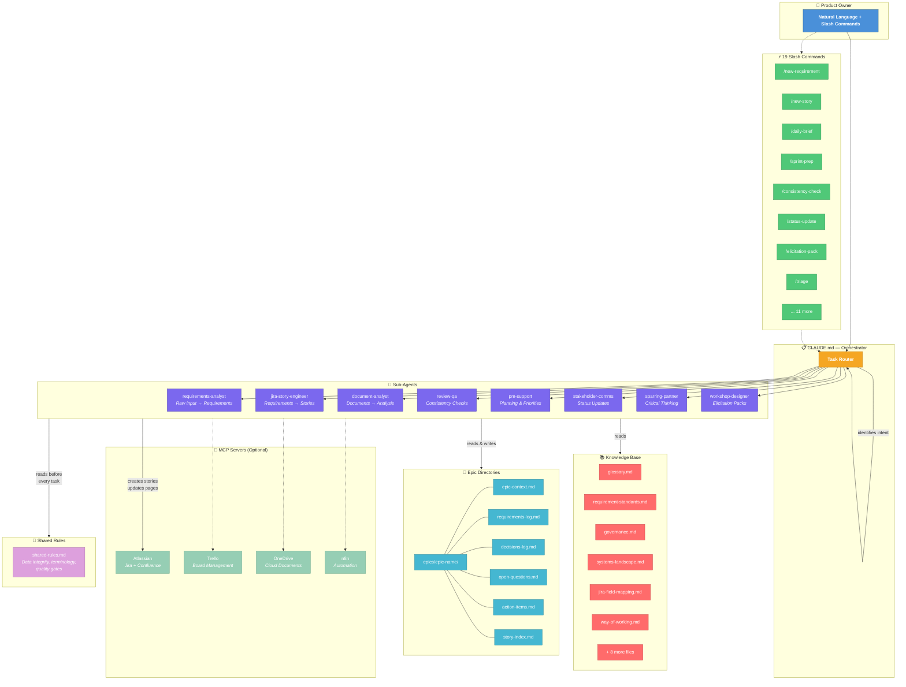
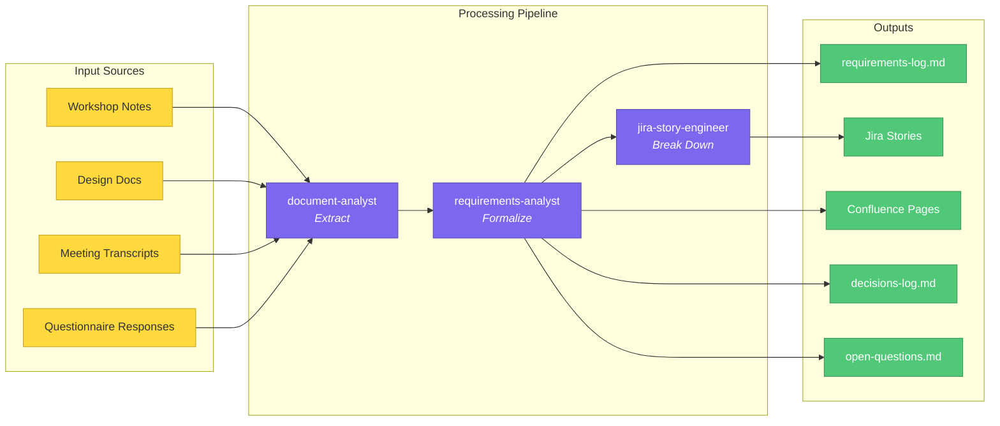
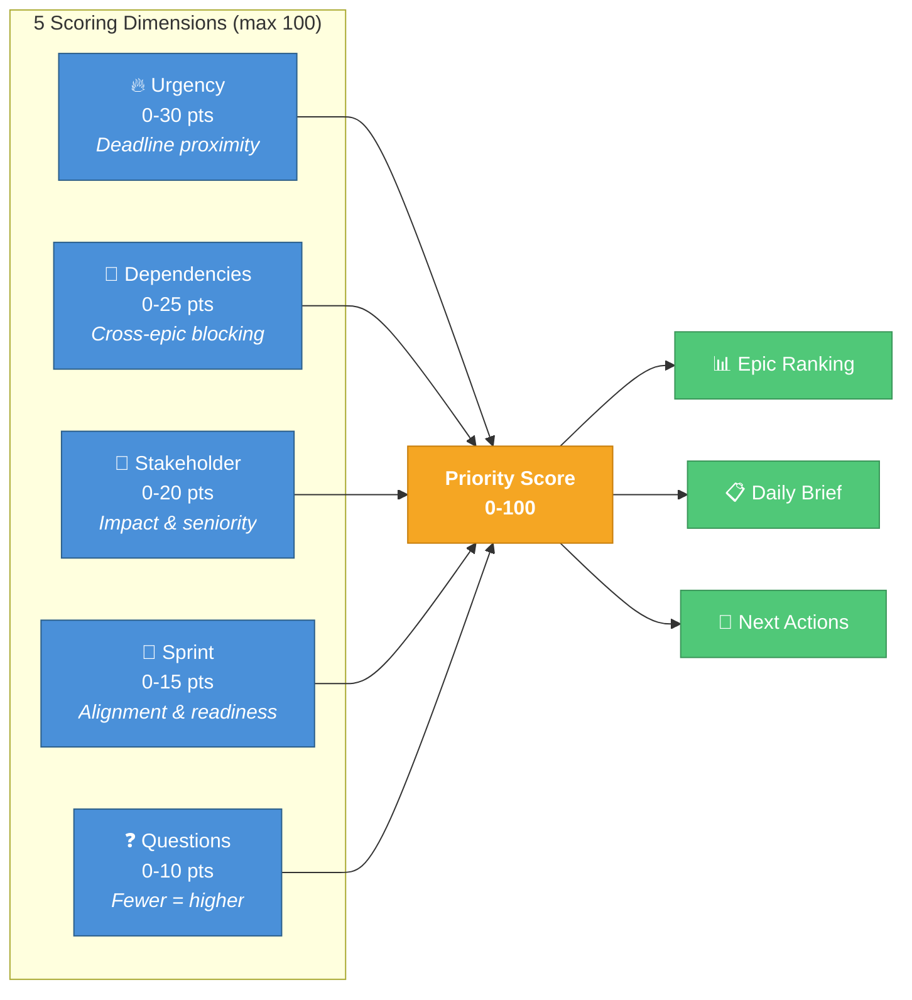

# Architecture Diagram

```mermaid
graph TB
    subgraph USER["👤 Product Owner"]
        U[Natural Language + Slash Commands]
    end

    subgraph ORCHESTRATOR["📋 CLAUDE.md — Orchestrator"]
        R[Task Router]
        R --> |"identifies intent"| R
    end

    U --> R

    subgraph AGENTS["🤖 Sub-Agents"]
        A1["requirements-analyst<br/><i>Raw input → Requirements</i>"]
        A2["jira-story-engineer<br/><i>Requirements → Stories</i>"]
        A3["document-analyst<br/><i>Documents → Analysis</i>"]
        A4["review-qa<br/><i>Consistency Checks</i>"]
        A5["pm-support<br/><i>Planning & Priorities</i>"]
        A6["stakeholder-comms<br/><i>Status Updates</i>"]
        A7["sparring-partner<br/><i>Critical Thinking</i>"]
        A8["workshop-designer<br/><i>Elicitation Packs</i>"]
    end

    R --> A1
    R --> A2
    R --> A3
    R --> A4
    R --> A5
    R --> A6
    R --> A7
    R --> A8

    subgraph SKILLS["⚡ 19 Slash Commands"]
        S1["/new-requirement"]
        S2["/new-story"]
        S3["/daily-brief"]
        S4["/sprint-prep"]
        S5["/consistency-check"]
        S6["/status-update"]
        S7["/elicitation-pack"]
        S8["/triage"]
        S9["... 11 more"]
    end

    U -.-> SKILLS
    SKILLS -.-> R

    subgraph KNOWLEDGE["📚 Knowledge Base"]
        K1["glossary.md"]
        K2["requirement-standards.md"]
        K3["governance.md"]
        K4["systems-landscape.md"]
        K5["jira-field-mapping.md"]
        K6["way-of-working.md"]
        K7["+ 8 more files"]
    end

    AGENTS --> |reads| KNOWLEDGE

    subgraph EPICS["📁 Epic Directories"]
        E1["epics/epic-name/"]
        E1a["epic-context.md"]
        E1b["requirements-log.md"]
        E1c["decisions-log.md"]
        E1d["open-questions.md"]
        E1e["action-items.md"]
        E1f["story-index.md"]
        E1 --- E1a
        E1 --- E1b
        E1 --- E1c
        E1 --- E1d
        E1 --- E1e
        E1 --- E1f
    end

    AGENTS --> |reads & writes| EPICS

    subgraph MCP["🔌 MCP Servers (Optional)"]
        M1["Atlassian<br/><i>Jira + Confluence</i>"]
        M2["Trello<br/><i>Board Management</i>"]
        M3["OneDrive<br/><i>Cloud Documents</i>"]
        M4["n8n<br/><i>Automation</i>"]
    end

    AGENTS --> |"creates stories<br/>updates pages"| M1
    AGENTS -.-> M2
    AGENTS -.-> M3
    AGENTS -.-> M4

    subgraph RULES["📏 Shared Rules"]
        SR["shared-rules.md<br/><i>Data integrity, terminology,<br/>quality gates</i>"]
    end

    AGENTS --> |"reads before<br/>every task"| RULES

    classDef user fill:#4A90D9,stroke:#2C5F8A,color:#fff,font-weight:bold
    classDef orchestrator fill:#F5A623,stroke:#C77D0A,color:#fff,font-weight:bold
    classDef agent fill:#7B68EE,stroke:#5A4DB5,color:#fff
    classDef skill fill:#50C878,stroke:#3A9659,color:#fff
    classDef knowledge fill:#FF6B6B,stroke:#CC4444,color:#fff
    classDef epic fill:#45B7D1,stroke:#2E8B9E,color:#fff
    classDef mcp fill:#96CEB4,stroke:#6EA98C,color:#fff
    classDef rules fill:#DDA0DD,stroke:#AA6DAA,color:#fff

    class U user
    class R orchestrator
    class A1,A2,A3,A4,A5,A6,A7,A8 agent
    class S1,S2,S3,S4,S5,S6,S7,S8,S9 skill
    class K1,K2,K3,K4,K5,K6,K7 knowledge
    class E1,E1a,E1b,E1c,E1d,E1e,E1f epic
    class M1,M2,M3,M4 mcp
    class SR rules
```

## Data Flow

```mermaid
graph LR
    subgraph INPUT["Input Sources"]
        WN["Workshop Notes"]
        DD["Design Docs"]
        MT["Meeting Transcripts"]
        QR["Questionnaire Responses"]
    end

    subgraph PROCESS["Processing Pipeline"]
        DA["document-analyst<br/><i>Extract</i>"]
        RA["requirements-analyst<br/><i>Formalize</i>"]
        JSE["jira-story-engineer<br/><i>Break Down</i>"]
    end

    subgraph OUTPUT["Outputs"]
        REQ["requirements-log.md"]
        STR["Jira Stories"]
        CON["Confluence Pages"]
        DEC["decisions-log.md"]
        OQ["open-questions.md"]
    end

    WN --> DA
    DD --> DA
    MT --> DA
    QR --> DA
    DA --> RA
    RA --> REQ
    RA --> DEC
    RA --> OQ
    RA --> JSE
    JSE --> STR
    RA --> CON

    classDef input fill:#FFD93D,stroke:#C7A31F,color:#333
    classDef process fill:#7B68EE,stroke:#5A4DB5,color:#fff
    classDef output fill:#50C878,stroke:#3A9659,color:#fff

    class WN,DD,MT,QR input
    class DA,RA,JSE process
    class REQ,STR,CON,DEC,OQ output
```

## Priority Scoring Algorithm

```mermaid
graph LR
    subgraph DIMENSIONS["5 Scoring Dimensions (max 100)"]
        A["🔥 Urgency<br/>0-30 pts<br/><i>Deadline proximity</i>"]
        B["🔗 Dependencies<br/>0-25 pts<br/><i>Cross-epic blocking</i>"]
        C["👥 Stakeholder<br/>0-20 pts<br/><i>Impact & seniority</i>"]
        D["🏃 Sprint<br/>0-15 pts<br/><i>Alignment & readiness</i>"]
        E["❓ Questions<br/>0-10 pts<br/><i>Fewer = higher</i>"]
    end

    A --> T["Priority Score<br/><b>0-100</b>"]
    B --> T
    C --> T
    D --> T
    E --> T

    T --> R1["📊 Epic Ranking"]
    T --> R2["📋 Daily Brief"]
    T --> R3["🎯 Next Actions"]

    classDef dim fill:#4A90D9,stroke:#2C5F8A,color:#fff
    classDef total fill:#F5A623,stroke:#C77D0A,color:#fff,font-weight:bold
    classDef output fill:#50C878,stroke:#3A9659,color:#fff

    class A,B,C,D,E dim
    class T total
    class R1,R2,R3 output
```
